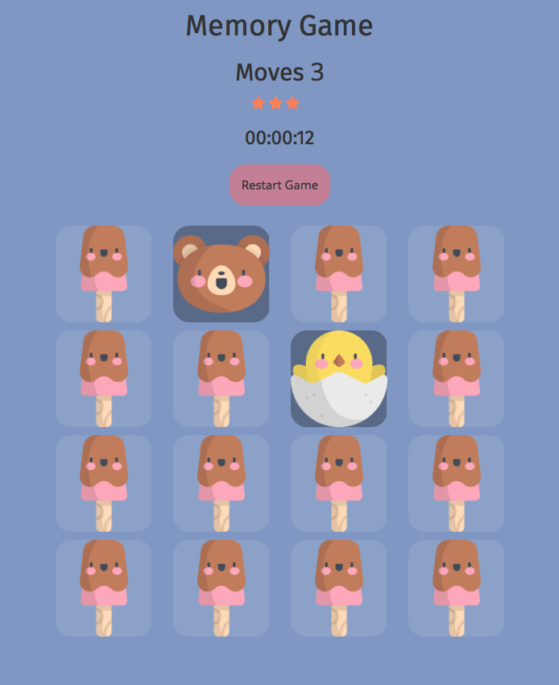

# Memory Game

This game will put your memory to the test.

## Goal
The goal of the game is to match the cards in as few moves as possible.

## Try it

[https://jprime81.github.io/memory-game/](https://jprime81.github.io/memory-game/)

## Mechanics

- Click a card to reveal what's behind it

- Clik another card to match what has been already revealed

- Once the cards are match, both will disappear

- Finish the game by matching all the remaining cards

## How this game was built

This game was built using HTML, JavaScript, and CSS.

- card deck is initialize as an array, then the cards are randomized using sort() and Math.random() methods

- clicks are tracked using an event listener, which then fires up the move counter

- the move counter fires up the timer once the first move (two clicks) is registered

- the star rating fires up when the allowed unmatched pair (move) threshold is met

- when all of the cards are matched, a pop-up modal window is shown revealing the number of moves made, the time spent, and the star rating
